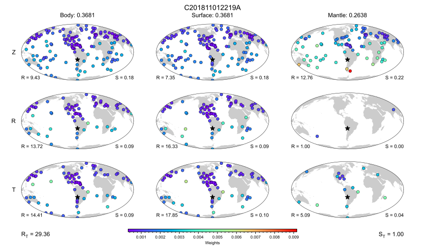

Results
-------

As part of the development of the software and for the accompanying paper, I 
created scripts for figure generations. Some, but not all, scripts are located
here in the `docs` folder for future reference. The scripts that are missing 
are the ones that require very large files, e.g. the figures that summarized the 
window measurements in Sawade et al. (2022). 

Figure 1 - Data & Model
+++++++++++++++++++++++

.. figure:: ../figures/events_stations_model.svg
    :alt: intro_figure

    *a)* Selection of 10,620 events from the GCMT catalog which are considered in
    this article. The events are chosen based on moment magnitude :math:`M_w`,
    where :math:`5.7 \leq M_w \leq 7.5`. *b)* Geographical distribution
    of stations and networks used for inversion. *c)* *P*-wave
    speed structure at 100 km depth according to tomographic model GLAD-M25,
    which is used in the forward modeling. 

.. include:: ../figures/scripts/intro_figure.py
    :language: python

Figure 3 - Geographical Misfit Weight distribution
++++++++++++++++++++++++++++++++++++++++++++++++++

    Component-wise weight distribution for Event C201811012219A. The event with
    a moment magnitude of 6.2 is located off the Dominican Republic's northern
    coast. The rows are identified at the very left for each component (Z-R-T).
    Each column is titled by a corresponding wave type and wave weight.  Each
    map is accompanied by factor R, the ratio of maximum and minimum weight,
    and S, the sum of the weights, for the wave type/component combination.
    :math:`\text{R}_\text{T}` is the same ratio but for all weights, and
    :math:`\text{S}_\text{T}` the sum of all weights, which naturally is one.

.. literalinclude:: ../figures/scripts/weights.py
    :language: python
   
.. _sec.catalog_comparion:

Figure 4 - Catalog Comparison
+++++++++++++++++++++++++++++

.. figure:: ../figures/catalog_comparison.svg
    :alt: cc_figure

    Statistical overview of the
    inverted events. *(a)* Distribution of inverted earthquakes
    across the globe.  *(b)* Change in source-type
    distribution. *(c)* Depth as a function of change in centroid
    depth :math:`\Delta z`. *(d)* Distribution of changes in centroid time
    :math:`\Delta t_{C}`. *(e)* Distribution of changes in scalar moment
    :math:`100\cdot\Delta (\ln M_0)`. *(f)* Distribution of changes in
    centroid depth. 

.. literalinclude:: ../figures/script/compare_catalogs.py
    :language: python 

Spatial Comparison
++++++++++++++++++

.. figure:: ../figures/spatial_relocation.svg
    :alt: spatial_relocation_figure

For the code, please see :ref:`sec.catalog_comparion`

Damping Choice Figure
+++++++++++++++++++++

.. figure:: ../figures/damping_mt.svg
    :alt: damping

    Changes in moment tensor components and hypocenter given a certain damping
    style and value. Figure summarizes the results of ~9900 events. Columns are
    the moment tensor parameters, rows are different damping styles top row
    shows damping of the entire diagonal of the Gauss-Newton Hessian prior to
    inversion, center row damps entire diagonal only if event depth is smaller 
    than 35 km, otherwise only hypocenter is damped, and for the bottom row 
    only the hypocenter was damped. damping values is always

    .. math:: 

        \lambda = c\,\, \mathrm{tr} \left( \mathbf{H} \right).

.. literalinclude:: ../figures/scripts/damping.py
    :language: python